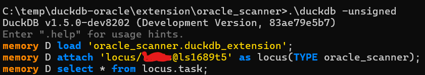
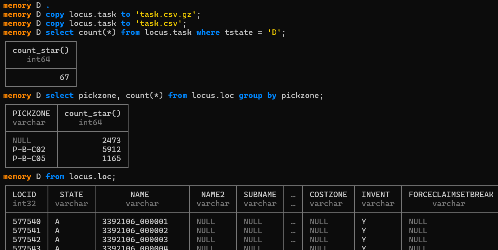

duckdb-oracle like duckdb-postgres but using Oracle via odpi.

This is weird!
Claude code converted the duckdb-postgres and after getting Cmake to work on windows
and fixing a deadlock bug this give some results!

and some queries of an internal database
